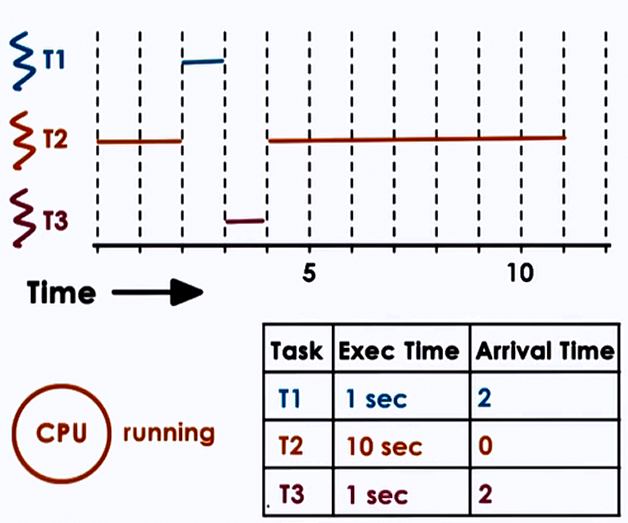
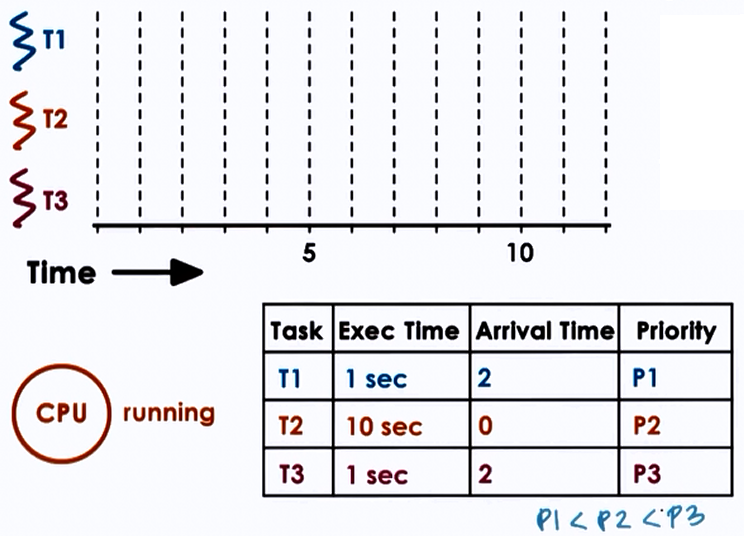
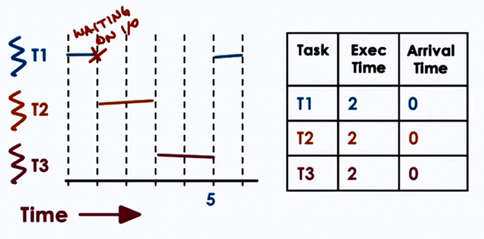
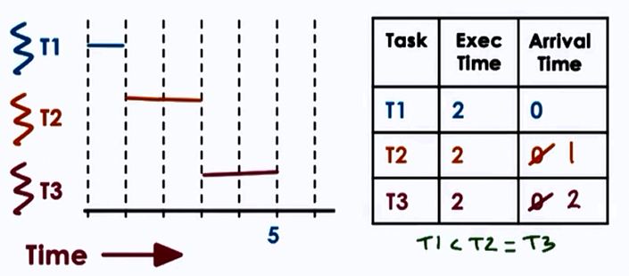
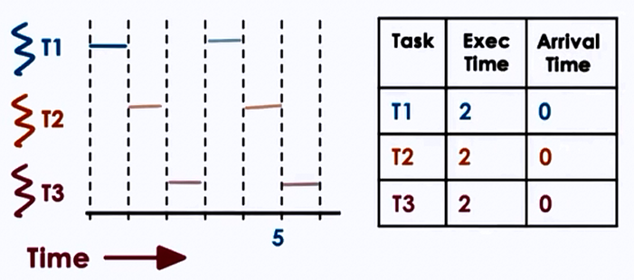
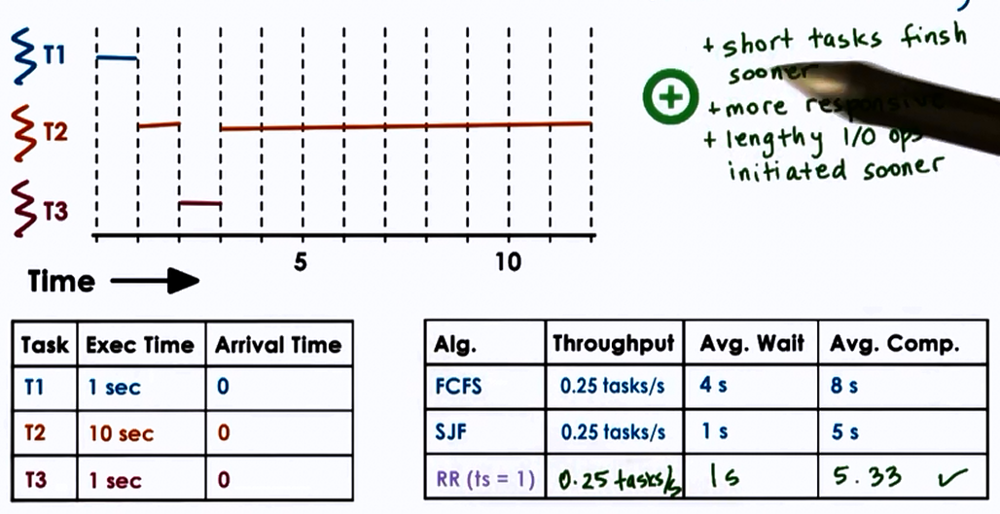
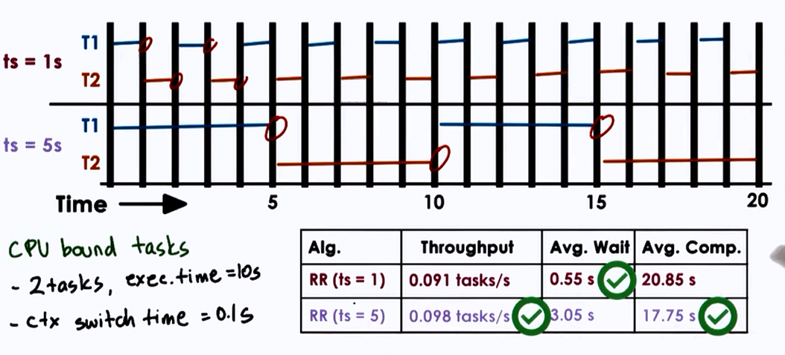
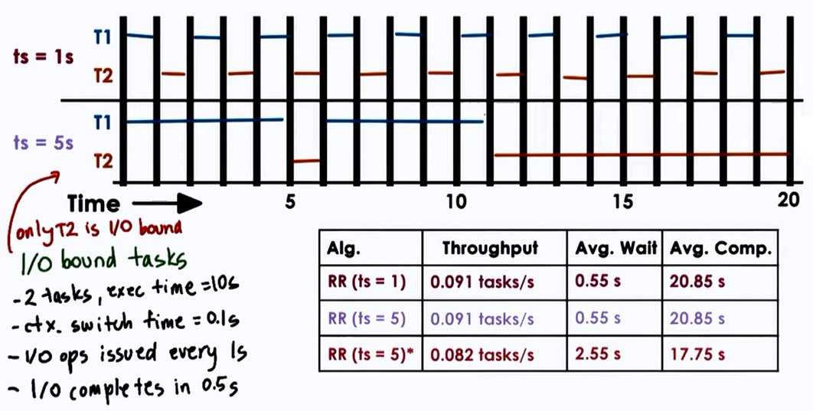

# Scheduling

Operating System perform scheduling in the following simple ways:

- Dispatch orders immediately
	- scheduling is simple FIFO (First-Come-First-Serve)
- Dispatch simple orders first
	- maximize number of orders processed over time
    - maximize throughput (SJF)
- Dispatch complex orders first
	- maximize utilization of CPU, devices, memory
    
## CPU Scheduler

- Decides how and when process (and their threads) access shared CPUs
- Schedules tasks running at user level processes/threads as well as kernel level threads
- Chooses one of the ready tasks to run on CPU
- Runs when
	- CPU becomes idle
    - new task becomes ready
    - timeslice expired timeout

Context switch, enter user mode, set PC and go! <= Thread is dispatched on CPU.

* Which task should be selected?
	- Scheduling policy/algorithm
* How is this done?
	- Depends on runqueue data structure
    
### "Run-to-completion" Scheduling

-Initial assumptions
	- group of tasks/jobs
    - known execution time
    - no preemption
    - single CPU
- Metrics
	- throughput
    - average job completion time
	- average job wait time
	- CPU utilization
    
## Scheduling algorithms:

### 1. First Come First Serve (FCFS)

* Schedules tasks in order of arrival

```
runqueue = queue(FIFO)
``` 

If T1, T2, T3 arrive in the given order and T1 has execution time 1s, T2 10s and T3 1s then :

* Throughput = 3/(1+10+1) = 3/12 = 0.25s
* Average completion time = (1 + 11 + 12)/3 = 8s
* Average wait time = (1+1+11)/3 = 4s

### 2. Shortest Job First (SJF)

* Schedules tasks in order of execution time
* Therefore for the above example, T1(1s) > T3(1s) > T2(10s)

```
runqueue = ordered(queue)

//or

runqueue = tree()
```

For SJF,
* Throughput = 3/(1+10+1) = 3/12 = 0.25s
* Average completion time = (1 + 2 + 12)/3 = 5s
* Average wait time = (0+1+2)/3 = 1s

### Preemptive Scheduling

* SJF + Preemption

T2 arrives first.



### Priority Scheduling

* Tasks have different priority levels
* Run highest priority task next (preemption)



```
runqueue = per priority_queue()

//or 

runqueue = tree() ordered on priority
```

* low priority task stuck in runqueue => starvation
- "priority aging" 
	- priority = f(actual priority, time spent in runqueue)
    - eventually tasks will run
    - prevents starvation
    
### 3. Round-Robin Scheduling

* Pick up the first task from queue (like FCFS)
* Task may yield to wait on I/O (unlike FCFCS)








#### Timeslicing

* Timeslice = max amount of uninterrupted time given to a task
* task may run less than timeslice
	- has to wait on I/O sync
    	- will be placed on queue
	- higher priority task becomes runnable
* using timeslice tasks are interleaved
	- timesharing the CPU
    - CPU bound tasks => preemption after timeslice
    
    

**Advantages**<br>
* Short tasks finish sooner
* More responsive
* Lengthy I/O operations initiated sooner
	- best to keep timeslice > context-switch-time
    
**Disdvantages**<br>    
* Overheads

#### How long should a timeslice be be?

* should balance benefits and overheads

### For CPU bound tasks: 

    

* Hence, for CPU bound tasks, larger timeslice values are better

### For I/O bound tasks: 

    

* Hence, for I/O bound tasks, smaller timeslice values are better
	- Keeps CPU and I/P devices busy, I/O bound tasks run quickly, makes I/O requests responds to a user.
    
### Summary

* CPU bound tasks prefer longer timeslices
	- limits context switching overheads
    - keeps CPU utilization and throughput
    
* I/O bound tasks prefer smaller timeslices 
	- However, if all the tasks in contention are I/O bound, it may not make such a difference
    - If a portion of them are I/O smaller timeslices keeps CPU and device utilization high
    - Provides better user-perceived performance

<hr>